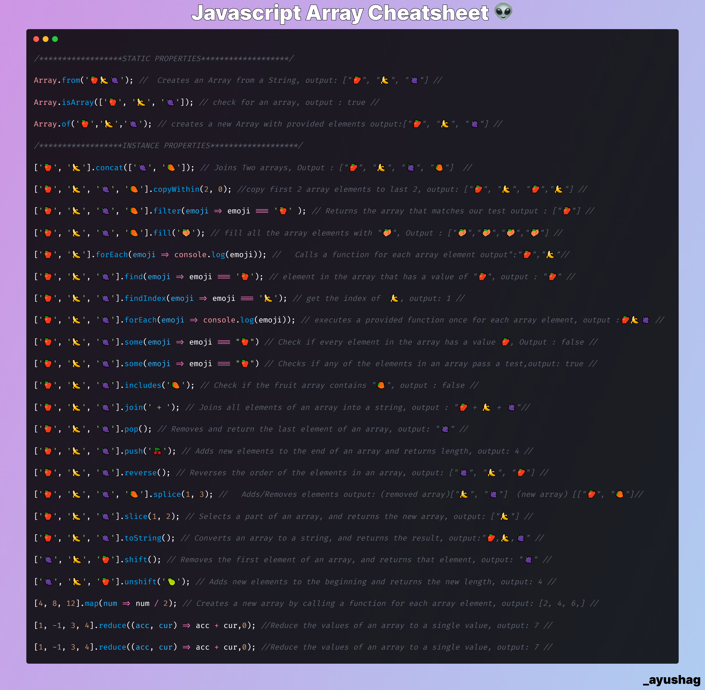

<h1 align="center">
  Javascript Array Cheatsheet👾
</h1>

 

<h2 align="center">
<a href="myFile.js" download>Click to download ☝</a>
</h2>

## Important 🚨

There is no way this is perfect or include all the methods. I'll try to fix/add more methods.For Now I have added only that methods that I knew about. Thanks for sparing your time and  dropping by. Drop a star if this helped you ✨ and share with someone whho could use this. Have a great day 🦄 .
